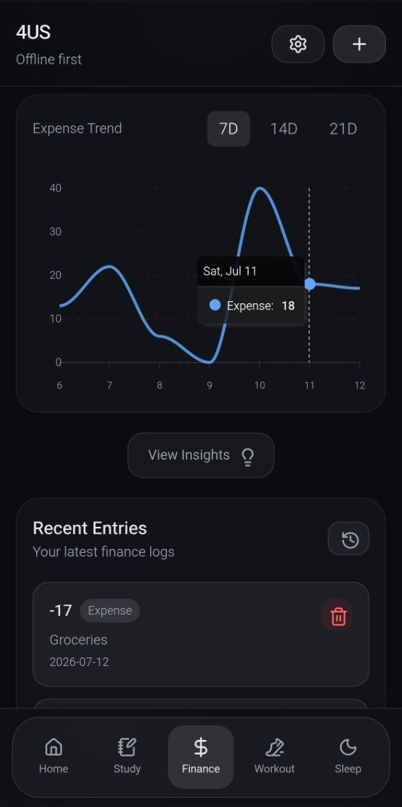
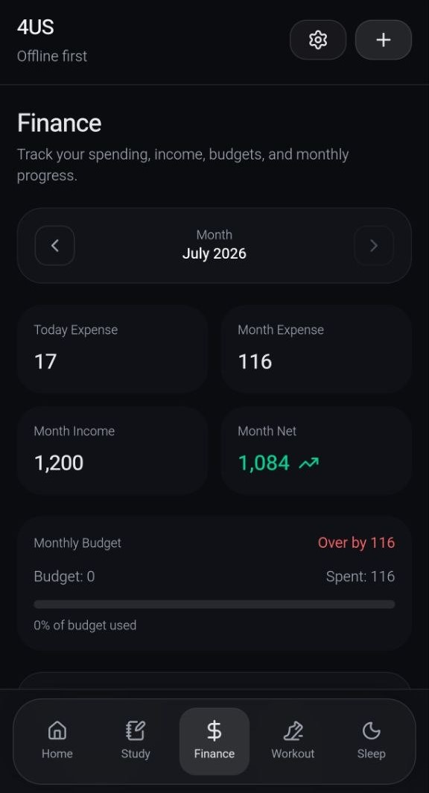
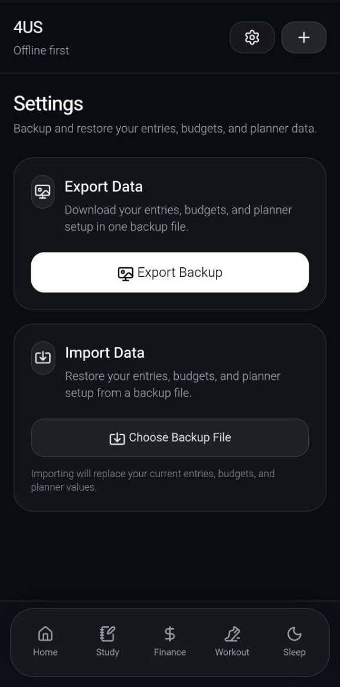
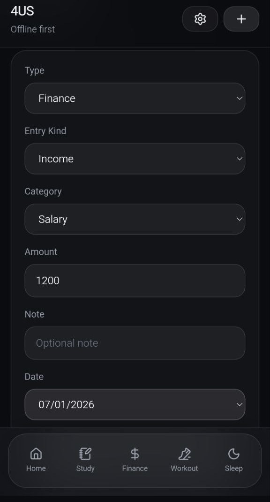
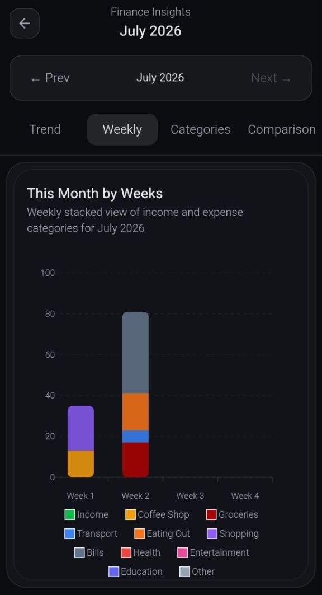

# 4US Habit Tracker

A mobile-first offline habit and life tracking PWA built with Vue, TailwindCSS, Pinia, and IndexedDB.

## Overview

4US Habit Tracker is a personal productivity and lifestyle tracking app designed for quick daily use on mobile devices. The app helps users track and review different areas of their life, including finance, sleep, study, and workout activities.

The project is built as an offline-first Progressive Web App, with local data storage and backup/import functionality planned or partially implemented.

## Screenshots

  
  
  

  
  

## Status

Work in progress.

The app is currently optimized for mobile use. Desktop responsiveness and additional polish are planned as future improvements.

## Features

- Dashboard for daily overview
- Add and manage personal entries
- Finance tracking and budget planning
- Sleep tracking and sleep insights
- Study tracking and study insights
- Workout tracking and workout insights
- History pages for different activity types
- Charts and visual insights
- Local-first data storage with IndexedDB
- Backup/import utility structure

## Tech Stack

- Vue 3
- Vite
- TailwindCSS
- Pinia
- IndexedDB
- JavaScript
- PWA-focused architecture

## Design Approach

This project follows a mobile-first approach because the main use case is quick daily tracking from a phone. The current version focuses on the mobile experience, with desktop layout improvements planned for future development.

## What I Learned

Through this project, I practiced:

- Building a multi-page Vue application
- Structuring reusable components
- Managing state with Pinia
- Working with local browser storage
- Creating dashboard and insight pages
- Designing mobile-first user interfaces
- Organizing a project for future PWA features

## Future Improvements

- Improve desktop responsiveness
- Add more polished UI states
- Add better data validation
- Improve backup and restore flow
- Add live demo deployment
- Add screenshots to this README
- Improve accessibility and keyboard navigation

## Project Purpose

This project was created as a personal learning and productivity tool. It also demonstrates my interest in practical digital products, frontend development, and the connection between technology, habits, and personal organization.